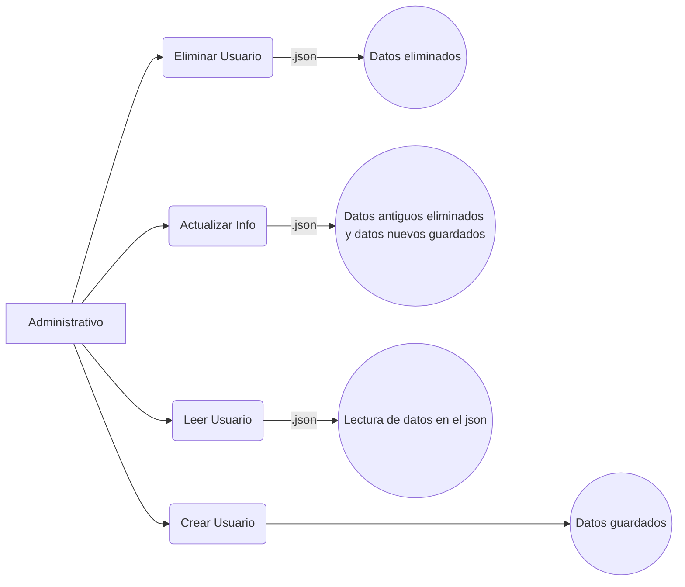

# Python Proyect 🚀
Este repositorio se uso para el desarrollo de un aplicativo en python el cual realizara un registro y manejo de datos para servicios de telefonia, productos, internet y señal de televisión en el cual el usuario tiene un menu con diferentes opciones para el uso de este aplicativo: modulo **administrativo**, **reportes** y **ventas**  

## Tabla de contenidos 📋
| Indice | Titulo  |
|--|--|
| 1 | [Instalación](#instalaciones) |
| 2 | [Modulo administrativo](#modulo-administrativo) |
| 3 | [Modulo reportes](#modulo-reportes) |
| 4 | [Modulo ventas](#modulo-de-ventas) |

### Instalaciones 🛠️
- Deberás descargar el el documento zip 
- Tienes que extraerlo con la opción extraer aquí
- Desplaza la carpeta generada a Visual Studio Code

### Modulo administrativo 💻

En este modulo encontrarás opciones las cuales te registrará, eliminará, actualizará y leerá tu información como usuario mediante el uso de archivos .json

### Modulo reportes 📢

En este modulo encontraras la información de los **servicios** y **productos** que has **adquirido** como usuario
  
Te mostrará:
- La cantidad de servicios que has adquirido 
- La cantidad de productos que has adquirido

> [!WARNING]
> Si no has adquirido ningun servicio o producto te saldra en ceros (0)

### Modulo de ventas 🛒

En este modulo podrás **adquirir** los **servicios** y **productos** que desees comprar

| Servicios | Productos  |
|--|--|
| Telefonía | Celulares |
| Planes | Computadores |
| Recargas | Audifonos |
| Internet | relojes inteligentes |

> [!IMPORTANT]
> Para un uso mas optimo del aplicativo debes leer muy bien las opciones del menu

Hecho por [JuanConde](https://github.com/juanconde025)
